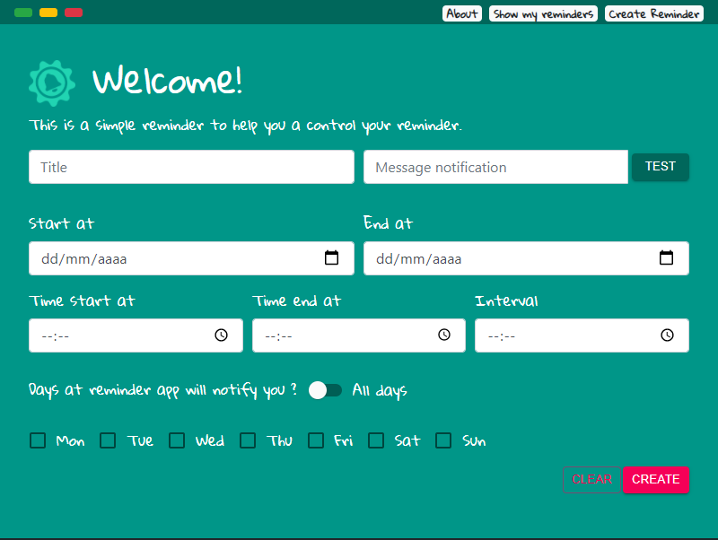

# Reminder App

This project was bootstrapped with [Create React App](https://github.com/facebook/create-react-app).

## Available Scripts

In the project directory, you can run:

### `yarn start`

Runs the app in the development mode.\
The app will open a application electron with devtools opened.

The page will reload if you make edits.\
You will also see any lint errors in the console.

## Screenshot

## Notice
app on construction

